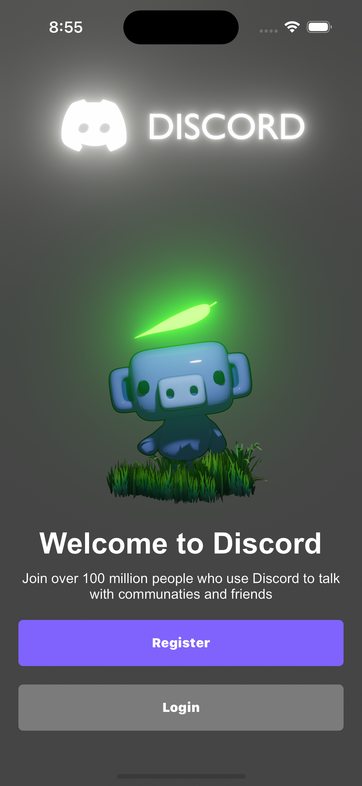
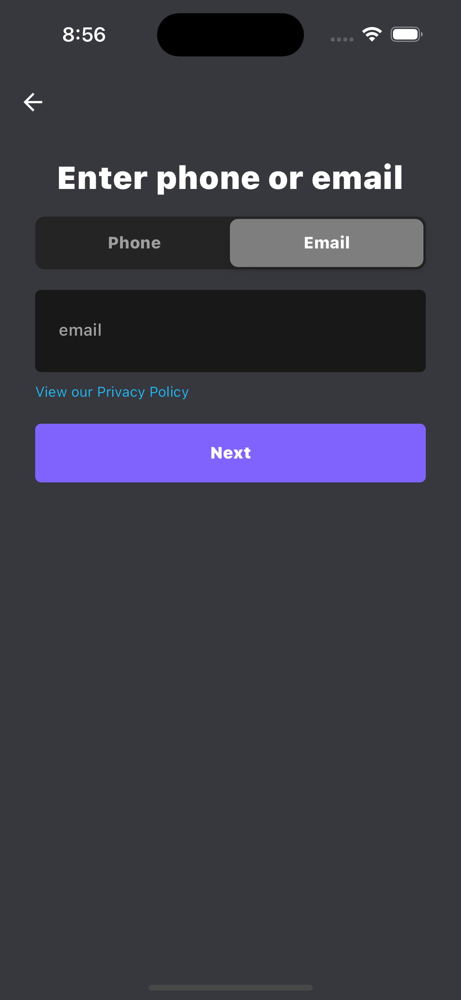
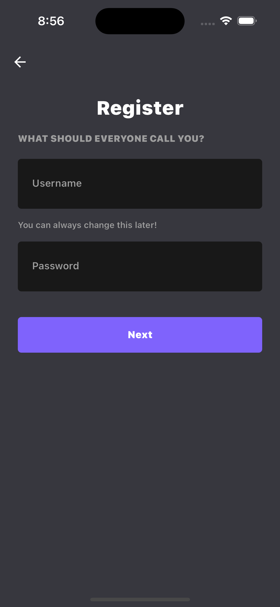
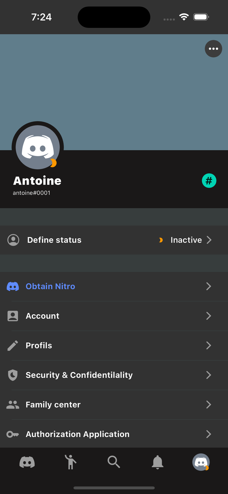
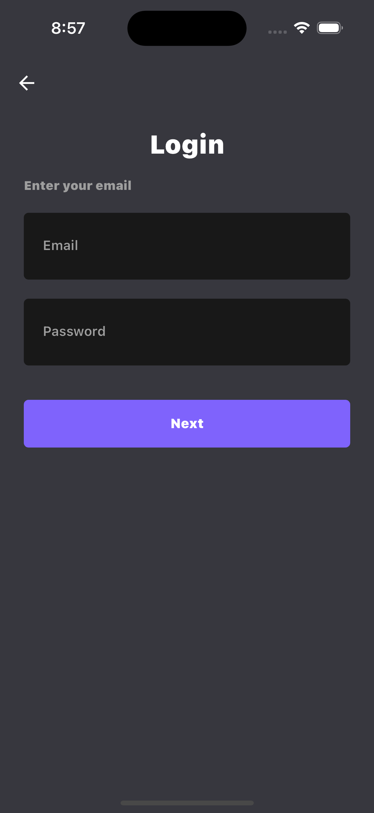
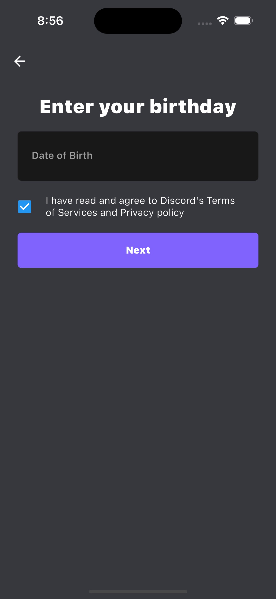
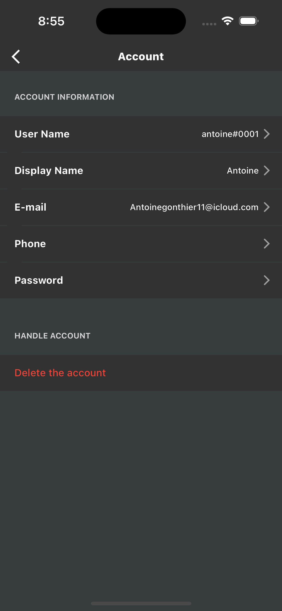
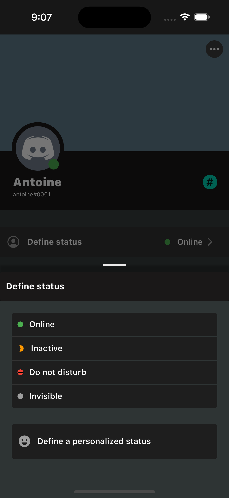

# Discord.

</img>

## Ultimate production app:
The project aims to clone the Discord social network in order to understand how this type of application could work, using Flutter framework, Express JS, MongoDB, GraphQL and Firebase Storage.
This repository is use for educationnal content.

## 🚧 The project if not finished.

The project is under construction, activly developed, `feel free to star the project` if you want to support me and be notify to the major update of the construction of this social network. This just the begining be patient!

## Screenshots

Onboard Page         |  Email Page       |   Register Page               |  Profile Page
:-------------------------:|:-------------------------:|:-------------------------:|:-------------------------:
|||

Login Page         |  Birthday Page       |   Edit Page               |  Status Page
:-------------------------:|:-------------------------:|:-------------------------:|:-------------------------:
|||

## 💡 Idea

if you want to see in realtime the progression of the evolution of project, follow the link: https://github.com/users/Antoinegtir/projects/7

## Aivailable on:

iOS, MacOS, Android, Web, Linux, Windows.

## Usage

- install node js
- run `npm install`
- fill `.env` value with correct data
- install MongoDB CLI or GUI and connect to localhost:27017
- go inside server folder `cd server` and hit `nodemon` in order to start the server
- install flutter engine -> https://docs.flutter.dev/get-started/install
- tap command `flutter run` in `client` folder

## Author

@Antoinegtir
